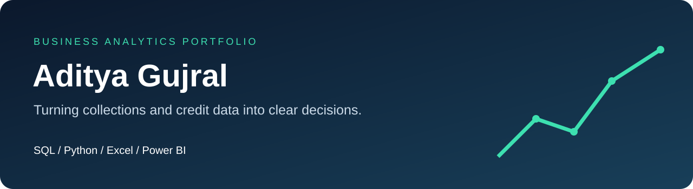

<a href="https://www.linkedin.com/in/aditya-gujral-b45618185/">LinkedIn</a> · <a href="mailto:aditya.gujral91@gmail.com">Email</a> · <a href="#featured-projects">Explore my work</a>

I’m Aditya Gujral, an MBA student focused on business analytics. I’m building practical skills in SQL, Python, Excel, and Power BI through projects that connect data quality, analysis, and business decisions.

My current portfolio explores **collections performance and credit risk** with reproducible synthetic data. Each project includes its source files, methodology, and validation notes.

## Featured projects

| Project | Business question | Explore |
|---|---|---|
| **SQL · Collections performance** | Where are recoveries strongest, and which accounts need attention? | [20 analytical queries, database, and findings](portfolio/sql_collections/) |
| **Python · Credit risk modeling** | Can account features help identify future 90+ day delinquency? | [Notebook, temporal validation, and model comparisons](portfolio/python_credit_risk/) |
| **Excel · Collections dashboard** | How can a manager track recovery, collector performance, and forecasts? | [Workbook, native charts, and validation](portfolio/excel_collections/) |
| **Power BI · Collections report** | How do recovery, collector reach, and aging exposure connect? | [Four-page native project and semantic model](portfolio/powerbi_collections/) |

## A shared collections view

The SQL, Excel, and Power BI projects reconcile to the same June 30, 2026 synthetic snapshot.

| Assigned accounts | Placed balance | Collected | Recovery rate |
|---:|---:|---:|---:|
| 1,500 | $18.51M | $2.35M | 12.68% |

The Python project uses a separate synthetic dataset and a time-based evaluation design. Its predictions are not attached to the collections dashboard.

## How I approach analysis

**Check the data → define the metric → investigate the pattern → communicate the decision.**

I focus on avoiding double-counting, making denominators explicit, separating training and evaluation periods, and keeping calculations reproducible.

## Tools and learning

**SQL** · joins, aggregations, window functions, data quality  
**Python** · pandas, scikit-learn, notebooks, model evaluation  
**Excel** · formulas, tables, charts, scenario forecasts  
**Power BI** · report definitions, relationships, DAX measures

All portfolio data is synthetic. The Power BI project has passed schema and data checks; opening, refreshing, DAX compilation, and visual rendering in Power BI Desktop remain pending.

---

Interested in analytics, collections, or credit risk? [Connect on LinkedIn](https://www.linkedin.com/in/aditya-gujral-b45618185/) or [email me](mailto:aditya.gujral91@gmail.com).
