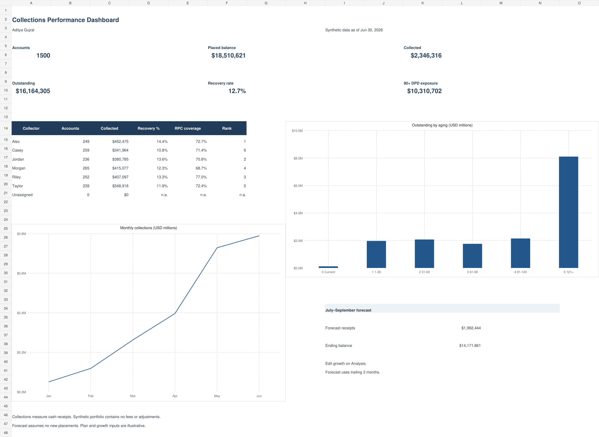

# Excel Collections Performance Dashboard

A formula-driven Excel portfolio by Aditya Gujral, built from the five-table SQL collections project. All 1,500 accounts and 3,010 receipts are synthetic (seed 42, June 30, 2026 snapshot). This Excel dataset reconciles to SQL; the Python prediction example has a separate dated dataset.

[Download the workbook](outputs/excel_dashboard/Aditya_Gujral_Collections_Dashboard.xlsx) · [Validation evidence](outputs/excel_dashboard/validation.json)

## Workbook

| Sheet | Purpose |
|---|---|
| Dashboard | Six KPIs, collector comparison, aging chart, monthly collections chart and three-month forecast |
| Analysis | KPI formulas, collector recovery/RPC/rank calculations, aging, monthly plan variance and forecast rollforward |
| Accounts | Original account attributes plus formula-driven receipts, remaining balances, aging and reached flags |
| Payments | Posted payment records with typed dates and amounts |

The workbook includes native editable charts, filterable Excel Tables, frozen source headers, growth-input validation, and conditional formatting for monthly shortfalls. It uses SUMIFS, COUNTIFS, IF, AVERAGE, EDATE and standard arithmetic. Contact counts are staged from SQL at account grain; payment totals calculate from the individual payment rows. No PivotTables or VBA are claimed.

## Verified results

- Placed: $18,510,620.97.
- Collected: $2,346,315.94.
- Outstanding: $16,164,305.03.
- Recovery: 12.6755% (12.7% dashboard display).
- 90+ DPD exposure: $10,310,701.73 (day 90 included).

Collectors with no assigned accounts show zero volume and `n.a.` for rates. RPC account coverage counts reached accounts / assigned accounts; dollars per RPC uses RPC contacts, not distinct accounts. Remaining balance assumes no fees, adjustments or charge-offs.

## Forecast and editable controls

On Analysis, amber cells `C38:C43` hold illustrative monthly plan inputs. They are fictional planning amounts, not employer targets. Cells `D49:D51` hold monthly July–September growth assumptions (initially 2%).

July begins with the mean April–June receipts. Each month's forecast = prior receipt baseline × (1 + growth), capped at that month's remaining balance. The next month rolls forward the ending balance and preceding forecast receipt baseline. No new placements are assumed. Missing growth is exposed as `Missing growth`; zero is a valid input. This is a transparent planning example, not a statistically fitted forecast.

Monthly receipt growth also reflects the synthetic account-placement schedule. It does not establish an actual operational improvement.

## Use and refresh

Download and open in Excel, enable calculation if needed, and change the amber planning inputs to explore projections. Source record edits update the workbook formulas and charts. Formula ranges are bounded to the supplied 1,500 accounts and 3,010 payments. Adding rows requires extending formulas and summary ranges; automatic new-row refresh is not claimed.

`inputs.json` preserves staged account attributes, individual payments and independent SQL controls. `build.mjs` preserves the authoring logic. Rebuilding the XLSX requires the ChatGPT Work runtime's `@oai/artifact-tool` package; it is not a standalone public npm setup. The delivered workbook runs independently of that package in Excel.

## Validation and limits

Key monetary totals were reconciled to independent SQL controls. Forecast growth changes, zero growth and missing growth were checked in the authoring calculation engine. Every sheet's opening area and the full Dashboard/Analysis views were rendered and inspected. Native chart bindings, tables, panes and formula caches were inspected in the exported XLSX. No native Excel application was available, so desktop Excel recalculation and interactive behavior were not independently tested.

## Resume project bullet

Created an Excel collections dashboard with 1,500 synthetic accounts, SUMIFS/COUNTIFS reporting, collector rankings, aging exposure, native charts and an editable three-month cash-receipt forecast; reconciled balances and receipts to a relational SQL project.

## Sources and definitions

- [SQL source project](../sql_collections/README.md)
- [Account-level view and join logic](../sql_collections/schema.sql)
- [SQL actuals and controls](../sql_collections/outputs/q01.csv)
