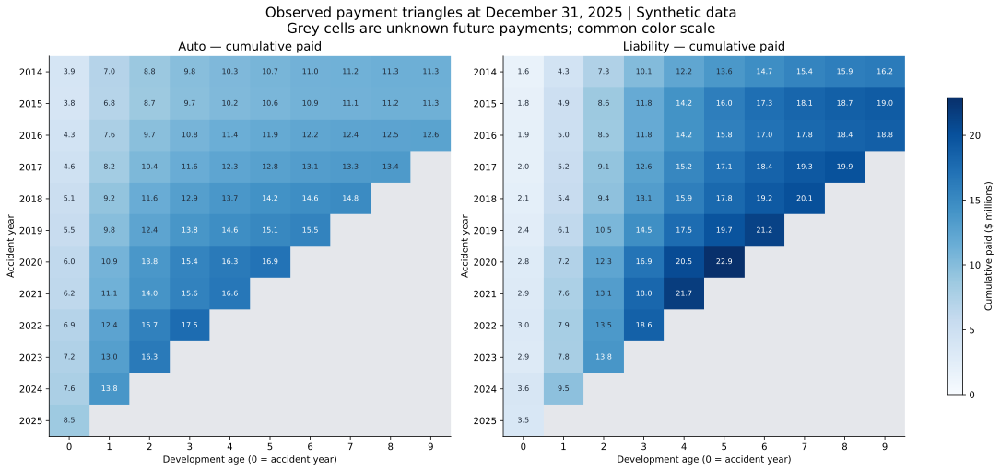
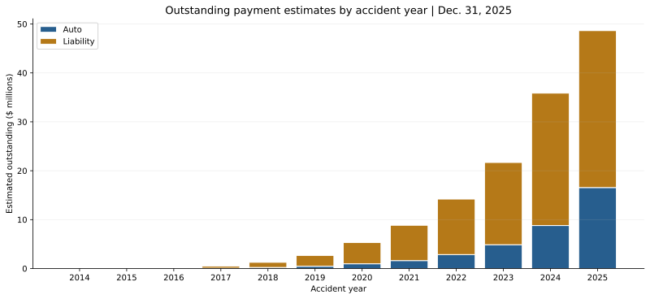
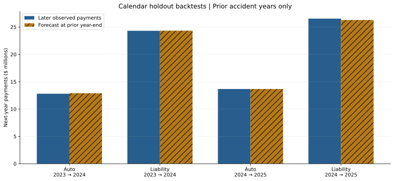
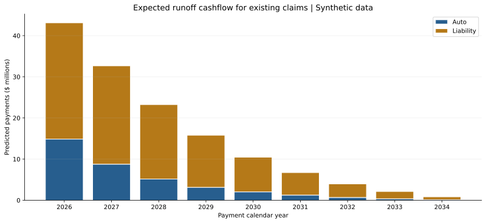

# Insurance Claims Reserving & Runoff Analytics

**Aditya Gujral · Python / Insurance / Financial Analytics**

An end-to-end insurance analytics case study that transforms **27,540 synthetic claims** into payment-development triangles, outstanding-payment estimates, calendar runoff forecasts and historical backtest evidence.

This adds insurance reserve forecasting and temporal payment validation to a portfolio that already covers credit-risk classification and retail SQL. **All data and results are synthetic. No real insurer or employer records are used.** This is an educational model, not a booked-reserve recommendation.

[Read the findings](FINDINGS.md) · [Explore the notebook](claims_reserving.ipynb) · [Methodology](docs/METHODOLOGY.md) · [Validation receipt](outputs/validation.json)

## Results at December 31, 2025

| Measure | Synthetic result |
|---|---:|
| Claims | 27,540 |
| Accident years | 2014–2025 |
| Observed paid amounts | $373.89 million |
| Estimated outstanding payments | $138.95 million |
| Forecast 2026 existing-claim payments | $43.12 million |
| Liability share of outstanding estimate | 73.79% |
| Two historical backtests, pooled cohort WAPE | 1.88% |

Exact values and calculations are in [outputs](outputs/). Forecast error is favorable partly because the generator intentionally uses stable line-specific payment patterns. It does not establish real-world forecast accuracy.



## Business questions

- How much is estimated outstanding in each line and accident year?
- Where is the outstanding payment estimate concentrated?
- What is the expected annual cashflow for existing claims?
- Do historical forecasts align with later observed payment diagonals?
- How sensitive are estimates to development and tail assumptions?

## Reproduce

Python **3.12.14** was used. From the repository root:

```bash
cd portfolio/insurance_claims_reserving
python -m venv .venv
# macOS / Linux:
source .venv/bin/activate
# Windows PowerShell alternative:
# .venv\Scripts\Activate.ps1
python -m pip install -r requirements.txt
python run_project.py
python -m unittest discover -s tests -v
python verify_backtests.py
python create_notebook.py
```

`run_project.py` regenerates deterministic inputs, fits the model, runs backtests and assertions, exports all results, writes findings, and renders four figures. It runs eight unit tests as part of the build. Generated files are confined to this project directory. No credentials, cloud service or proprietary dataset are required.

The raw CSVs are excluded from Git and regenerated with seed **20261005**. Figures use text-based SVG for GitHub previews; local PNGs support notebook rendering. Exact dependencies are pinned in `requirements.txt`. `create_notebook.py` produces the companion notebook with saved outputs and records the actual execution route in `outputs/notebook_validation.json`.

In the authoring environment, Jupyter's kernel could not start because network/socket operations were restricted. All six notebook code cells were instead executed sequentially in a fresh Python subprocess, retaining tables and figure outputs. The notebook format passed validation and the project figures were visually inspected; a complete rendered notebook viewer was unavailable. Standard Jupyter-kernel execution remains unverified here.

## Model design

`src/reserving.py` implements volume-weighted paid chain ladder directly with NumPy and pandas. Auto and Liability use separate development factors. Source amounts are integer cents; projections are floating-point cents and exports retain precision.

1. Keep only observable payment cells at the valuation cutoff.
2. Aggregate incremental payments into cumulative accident-year / development-age triangles.
3. Estimate adjacent-age factors from origins observable at **both** ages.
4. Apply remaining factors to the latest cumulative paid value.
5. Subtract paid from estimated ultimate to obtain estimated outstanding payments.
6. Difference projected cumulative values into calendar runoff cashflow.

Unknown future cells stay `NaN`; they are never treated as observed zero. The base tail is 1.00 only because the generator finishes every claim by age nine. The outstanding estimate is **ultimate minus paid**, not pure IBNR: case reserves and claim-reporting dates are absent.



## Historical evaluation

At the end of **2023** and **2024**, fit only available payments and forecast the next calendar year's payments for already-existing accident years. Compare against the held-out 2024 and 2025 payment diagonals. New accident years are excluded from forecast and actual denominators. No later diagonal or ultimate truth informs the fit.

WAPE is sum of absolute origin-level errors / sum of actual payments. Pooled WAPE is recomputed from those dollar numerators and denominators. The zero-future-payment baseline has 100% WAPE. Neither evaluation is a confidence interval or a claim of reserve adequacy.



Hidden synthetic ultimate values are used **only after** current forecasts have been created, as a separate simulation diagnostic. This is not an observed real-world ultimate test.

## Runoff and deterministic sensitivity



Development stresses change the excess of each factor above one by ±5%: `1 + multiplier × (factor − 1)`. The +5% case raises the total estimate to **$149.23 million**, a **7.40%** change. A separate hypothetical 2% ultimate-tail factor raises outstanding to **$149.21 million**. Scenario values are in [sensitivity_scenarios.csv](outputs/sensitivity_scenarios.csv).

These are deterministic assumptions, **not** probabilistic intervals or capital estimates. No post-age-nine timing is assigned to the extra-tail scenario. The base runoff schedule includes existing claims only; it excludes new claims arising after 2025.

## Validation

The build passes **12 data/reconciliation checks and 8 unit tests**:

- Independent standard-library CSV sums reconcile paid amounts, all selected development-factor numerators and denominators, and reserve products.
- Forecast cashflow sums to the base estimated outstanding balance.
- Claim keys and registry attributes match; payment dates respect the cutoff.
- Observed and hidden future payments reconcile exactly to simulated final claim severity.
- Known-answer fixtures test ultimate estimation, paired-origin eligibility, missing future cells, mature cohorts, unsupported ages, leakage rejection and stress/tail behavior.

Input SHA-256 hashes, package versions, check outcomes and test counts are retained in [validation.json](outputs/validation.json). Notebook execution status is recorded separately.

Two additional independent CSV/Decimal checks reconcile the exact historical holdout population, raw actual payments, WAPE and bias denominators; see [backtest_verification.json](outputs/backtest_verification.json).

## Limitations

The synthetic process gives Liability higher severity and slower development, increases cohort severity by 3.5% annually, and keeps timing patterns stable. It is not empirically calibrated. The known claim registry has no reporting-delay process. No case reserves, incurred losses, expenses, recoveries, reinsurance, policy limits, premiums, discounting or reserve probability intervals are modeled.

For a real insurer, evaluate changing settlement and calendar effects, source completeness, empirical tail factors and uncertainty, then obtain actuarial review. See the full [methodological contract](docs/METHODOLOGY.md).

## Project files

| File | Purpose |
|---|---|
| `run_project.py` | End-to-end analysis, backtests, verification and charts |
| `src/generate_data.py` | Seeded claim severity and exact-cent payment generator |
| `src/reserving.py` | Triangle, factors, reserves and runoff functions |
| `tests/test_reserving.py` | Eight analytical contract tests |
| `verify_backtests.py` | Independent raw-CSV holdout and Decimal metric verification |
| `claims_reserving.ipynb` | Reproducible notebook companion with saved output |
| `docs/METHODOLOGY.md` | Business questions, formulas, assumptions and evaluation design |
| `outputs/` | Exact model outputs, backtests, sensitivities and receipts |
| `figures/` | Four source-backed SVG charts |

## Resume bullet

Built a reproducible Python insurance-analytics project using 27,540 synthetic claims; implemented line-specific paid chain-ladder forecasting, runoff cashflows, historical calendar holdouts, deterministic reserve sensitivity, and 22 analytical checks and tests with independently reconciled results.

## Reputable methodological sources

- [Casualty Actuarial Society: Chain Ladder tutorial](https://opensourcesoftware.casact.org/chain-ladder)
- [CAS Tail Factor Working Party: Tail Development Factors, 2013](https://www.casact.org/sites/default/files/database/forum_13fforum_02-tail-factors-working-party.pdf)
- [NumPy: Generator.dirichlet](https://numpy.org/doc/stable/reference/random/generated/numpy.random.Generator.dirichlet.html)

Reviewed October 5, 2026. No external data or source code was copied into this project. Primary project evidence is the generator, implementation, outputs and validation receipts linked above.
