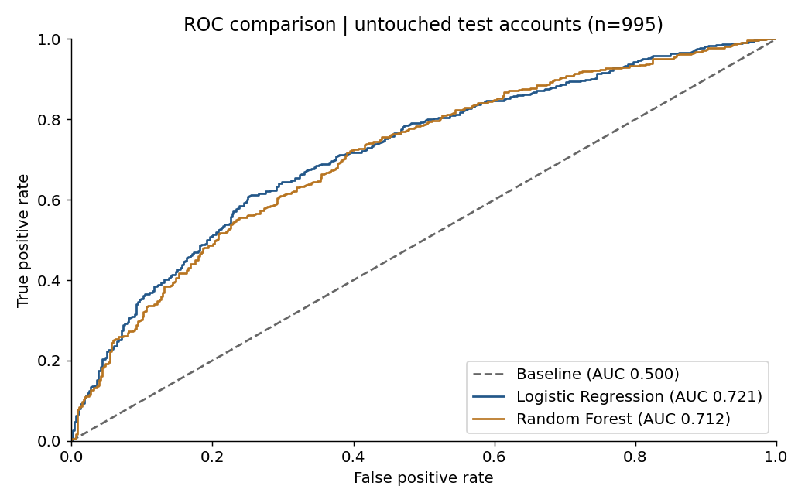
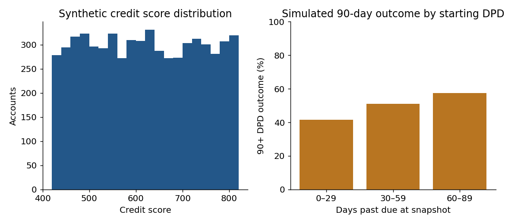
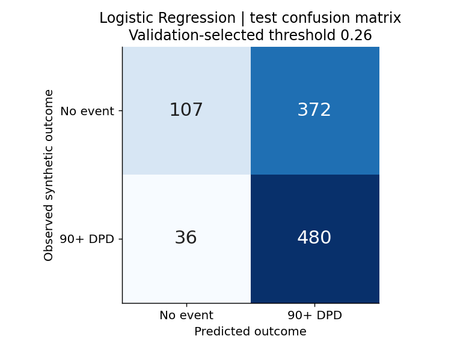
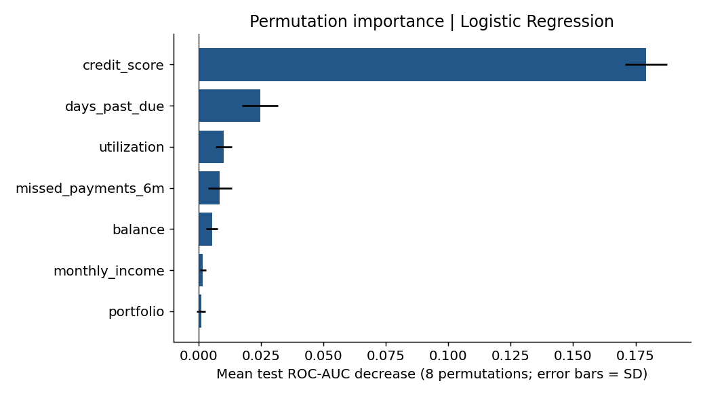

# Credit Risk — 90-Day Delinquency Prediction

A complete, reproducible Python portfolio by Aditya Gujral: synthetic data generation, exploration, leakage-safe pipelines, temporal validation, model comparison and unlabeled account scoring.

**Result:** Logistic Regression selected on validation ROC-AUC achieved **0.721 test ROC-AUC** versus **0.712** for Random Forest. These are illustrative synthetic results, not claims of real-world credit-risk performance.

[Open the executed notebook](credit_risk_analysis.ipynb) · [Exact metrics](outputs/test_metrics.csv) · [Verification](outputs/verification.json)



## Reproduce

Python 3.12 was used. From the repository root:

```bash
cd portfolio/python_credit_risk
python -m venv .venv
# macOS/Linux: source .venv/bin/activate
# Windows: .venv\Scripts\activate
python -m pip install -r requirements.txt
python model.py
python verify_outputs.py
python create_notebook.py
```

Or open `credit_risk_analysis.ipynb` in Jupyter or VS Code and run all cells. The notebook includes saved outputs for reading without execution. `create_notebook.py` runs cells sequentially in a fresh Python process with captured rich displays because the authoring environment blocks kernel sockets. The notebook format and code execution passed; a rendered preview of all sections and figures was inspected. Standard Jupyter kernel execution was unavailable in this environment. Requirements include Jupyter dependencies for readers running it locally.

Generated data, outputs, figures and the notebook are overwritten only in this project folder. Models are reconstructed from code; no serialized model file is needed.

## Objective and data

Predict a simulated transition to **90+ days past due within the next 90 days**, given snapshot features. This delinquency proxy is not legal default. 6,000 fictional historical snapshots span 2025, with outcomes mature by March 31, 2026. Another 500 disjoint, unlabeled accounts are scored at June 30, 2026. One snapshot per customer prevents entity overlap. This dated dataset is independent of the SQL project; SQL account balances should not be reconciled to it.

Features: starting DPD, credit score, monthly income, balance, utilization, prior-six-month missed payments and product type. Account/customer IDs, dates and future outcomes are excluded from model inputs. See [data dictionary](DATA_DICTIONARY.md) and [transparent generator](generate_data.py). Outcomes are sampled from an explicit logistic formula plus an unobserved shock; they are not observed payment trajectories.

## Evaluation design

- Train: January–March 2025 snapshots. Validation: July 2025. Test: November–December 2025.
- Embargo periods ensure each earlier cohort's 90-day outcomes finish before the next cohort begins. Excluded rows are counted in [run summary](outputs/run_summary.json).
- Median imputation, scaling and categorical encoding fit on training only.
- Logistic Regression and Random Forest use fixed settings. Select the winner on validation ROC-AUC; test data is used only for evaluation and descriptive importance diagnostics.
- Compare all models at threshold 0.50 in `test_metrics.csv`. A separate validation-selected F2 threshold of 0.26 emphasizes recall; its test metrics are reported separately in `operating_point_metrics.csv`.
- At the illustrative operating point, selected-model test precision is 56.3% and recall is 93.0%. This is not a capacity- or cost-optimized business threshold.
- A prior-only DummyClassifier provides a baseline. Because training prevalence is above 50%, at threshold 0.50 it predicts an event for every test account; its ROC-AUC remains 0.50.
- No refit after evaluation: the evaluated fitted model scores the separate 500 accounts. Scores are illustrative and are not proven calibrated probabilities.

## Findings and visuals



Higher starting DPD is associated with more generated events; the generator intentionally encodes this relationship. Logistic Regression performs slightly better than Random Forest on the test cohort, but the difference is descriptive and no significance claim is made.



The lower review threshold catches more events while producing more false positives. Real implementation would require review capacity and error costs.



Importance is the mean change in test ROC-AUC over eight feature-shuffle repetitions. Error bars show standard deviation across repeats, not confidence intervals. Importance is neither causal nor used for model selection.

## Deliverables and verification

| File | Purpose |
|---|---|
| `credit_risk_analysis.ipynb` | Executed notebook with explanations, tables and four figures |
| `generate_data.py` | Reproducible historical and scoring data |
| `model.py` | Pipelines, temporal splits, validation selection, evaluation and scoring |
| `verify_outputs.py` | Independent rank-based AUC and confusion-count reconciliation |
| `data/` | Historical snapshots and separate unlabeled scoring accounts |
| `outputs/` | Validation/test metrics, threshold sweep, holdout predictions, importance, scores and checks |
| `figures/` | Four actual generated charts |

Checks cover unique grain, outcome maturity, disjoint customers, excluded targets, class coverage, independent AUC, confusion counts and score bounds/ranking. Exact package versions are pinned.

## Limitations and next steps

Simulation demonstrates implementation, not production validity. Real data would require empirical target definitions, repeated-customer grouping, temporal robustness, calibration, uncertainty analysis, fairness assessment and operational cost validation. No employer data or real customer information is included. No claims of financial savings or improved collections are made.

## Resume project bullet

Developed a Python delinquency-risk portfolio using pandas and scikit-learn with leakage-safe preprocessing, temporally separated cohorts, Logistic Regression/Random Forest comparison, independent metric reconciliation, and scoring for 500 synthetic accounts.

## Primary methodological references

- [scikit-learn: leakage and pipelines](https://scikit-learn.org/stable/common_pitfalls.html#data-leakage)
- [scikit-learn: classification metrics](https://scikit-learn.org/stable/modules/model_evaluation.html#classification-metrics)
- [scikit-learn: permutation importance](https://scikit-learn.org/stable/modules/permutation_importance.html)
