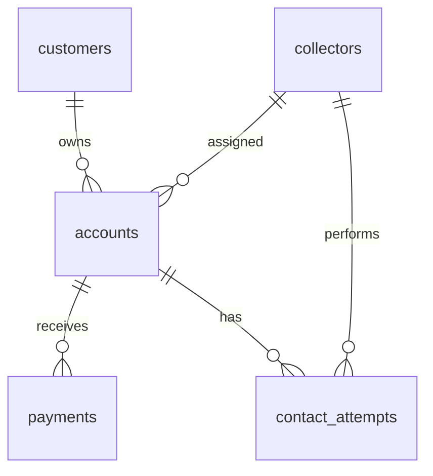

# Collections & Recovery Analytics — Relational SQL

A reproducible analyst portfolio by Aditya Gujral. Five related tables support 20 business analyses using INNER JOIN, LEFT JOIN, anti joins, CTEs, conditional aggregation and window functions. All records are fictional, generated with seed 42. No employer or customer data is used.

## Business problem

How can a collections team measure recovery, compare collectors, identify aging exposure and prioritize follow-up without double-counting transactions?

## Run in two minutes

Requires Python 3.9+ with SQLite 3.25+; no third-party packages.

```bash
cd portfolio/sql_collections
python3 build.py
```

The script builds `collections.db`, generates five CSV tables and a standalone `data/seed.sql`, executes all 20 queries, exports results to `outputs/`, and validates integrity, foreign keys, balances, payment reconciliation and join fanout. Existing generated files in this project folder are replaced; unrelated files are untouched.

Open `collections.db` in DB Browser for SQLite, or use the SQLite CLI:

```bash
sqlite3 collections.db < analysis.sql
# Alternatively import the full standalone dump into a NEW database:
sqlite3 new_collections.db < data/seed.sql
```

`seed.sql` already includes the schema: do not apply `schema.sql` first when importing it. `schema.sql` is the readable empty-schema definition.

## Data model



| Table | Grain | Generated rows |
|---|---|---:|
| customers | One fictional customer | 1,200 |
| collectors | One collector, including an inactive collector | 7 |
| accounts | One placed account | 1,500 |
| payments | One posted payment | 3,010 |
| contact_attempts | One contact attempt | 6,013 |

Snapshot: June 30, 2026. Amounts are stored as integer cents and converted to dollars only for reporting. `days_past_due` is a snapshot attribute, not a historical series. Collectors are assigned once; contact attribution uses the performing collector ID. Multiple accounts may belong to the same customer.

## Analyses

| Query | Business question | SQL techniques |
|---|---|---|
| Q01 | Portfolio recovery KPIs | Aggregate view, NULLIF |
| Q02 | Recovery by product | GROUP BY |
| Q03 | Aging exposure | CASE buckets |
| Q04 | Collector recovery ranking | CTE, DENSE_RANK |
| Q05 | Contact conversion including inactive collectors | LEFT JOIN |
| Q06 | Monthly and cumulative collections | Window SUM |
| Q07 | Monthly growth | LAG |
| Q08 | Multi-account customers | INNER JOIN, HAVING |
| Q09 | Accounts with no payments | LEFT JOIN anti join |
| Q10 | Contacted accounts without RPC | Conditional aggregation |
| Q11 | RPC account coverage and dollars per RPC | NULLIF |
| Q12 | Score-band exposure | CASE |
| Q13 | High-balance follow-up list | Filters, ordering |
| Q14 | Exposure quartiles | NTILE |
| Q15 | Latest contact per account | ROW_NUMBER, LEFT JOIN |
| Q16 | Regional recovery | Customer/account joins |
| Q17 | Placement cohort recovery | Date grouping |
| Q18 | 90+ DPD exposure share | Conditional SUM |
| Q19 | Due promise fulfillment proxy | Date-range LEFT JOIN |
| Q20 | Time to first receipt | CTE, INNER JOIN, JULIANDAY |

## KPI definitions and limitations

- Recovery rate = receipts / original placed balances. Outstanding = placed minus receipts; there are no fees, adjustments or charge-offs in this example.
- RPC (right-party contact) includes `RPC` and `PTP` outcomes. RPC account coverage counts accounts reached / accounts. RPC contact conversion counts RPC contacts / contact attempts. These are different metrics.
- Dollars per RPC is total receipts / RPC contacts; it does not prove a contact caused a payment.
- PTP (promise to pay) fulfillment is an illustrative proxy comparing payments between contact and due dates against promised amount. There is at most one promise per generated account; no real-world payment-to-promise attribution is claimed. Future-due promises are excluded.
- 90+ DPD means >=90 days, consistently. Aging bucket 61–90 includes day 90; Q18 uses the exact numeric threshold.
- Cohorts differ in seasoning. Collector rankings are descriptive and do not adjust for account mix.
- Synthetic distributions are designed for SQL practice, not estimates of actual collections performance. This upgrade creates a new deterministic dataset; it is not a reconciliation with the other portfolio projects.

## Correctness

`account_summary` separately aggregates payments and contacts to account grain before joining. Joining both raw fact tables directly would multiply payment rows by contact rows. A dedicated fixture with two payments and three contacts checks that receipts remain $300 and attempts remain three; a second fixture checks accounts without events. Generated output: all 20 queries run successfully, all eight validation categories pass. See [validation.json](outputs/validation.json), [executive results](outputs/q01.csv) and [findings](FINDINGS.md).

## Files

- `schema.sql`: constrained tables, indexes and safe account-level view.
- `analysis.sql`: 20 labeled business queries.
- `build.py`: deterministic data generation, execution, export and validation.
- `data/`: five CSV files and portable SQL dump.
- `outputs/`: actual query results and validation report.
- `DATA_DICTIONARY.md`: field definitions.

## Resume project bullet

Built a five-table SQLite collections analytics project with 1,500 synthetic accounts and 20 SQL analyses using joins, CTEs and window functions; validated transaction reconciliation and prevented payment/contact fanout in recovery KPIs.

## Technical references

- [SQLite JOIN and SELECT semantics](https://www.sqlite.org/lang_select.html)
- [SQLite foreign keys](https://www.sqlite.org/foreignkeys.html)
- [SQLite window functions](https://www.sqlite.org/windowfunctions.html)
- [Python sqlite3 documentation](https://docs.python.org/3/library/sqlite3.html)
